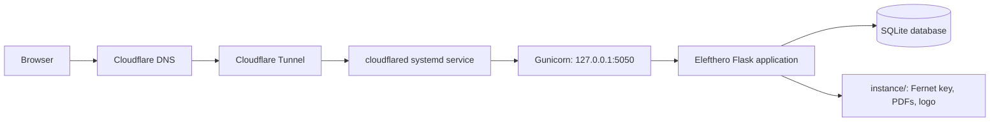
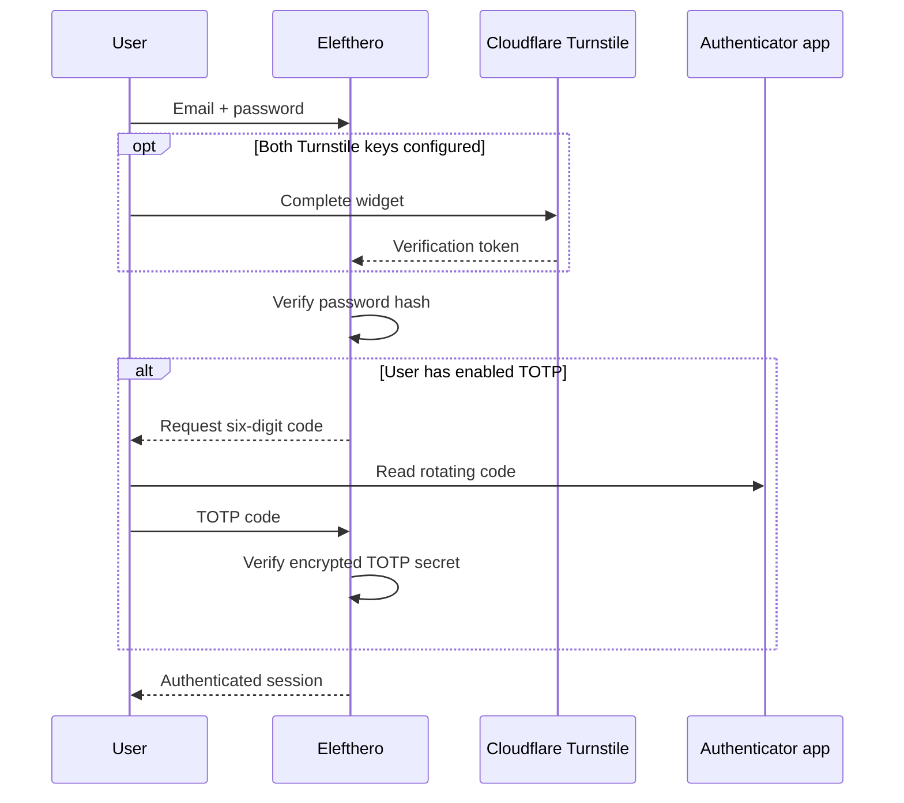
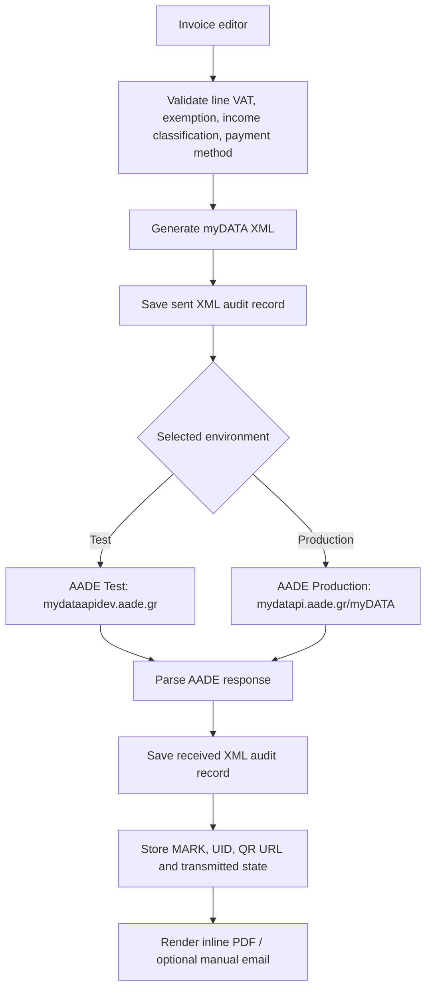
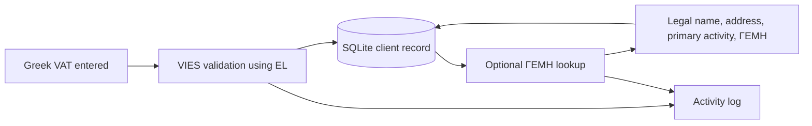

# Elefthero

## The open-source way to invoice in Greece

Elefthero (Ελεύθερο) is a self-hosted Flask application for Greek small businesses that issue and transmit a focused set of AADE myDATA invoices. It prioritises understandable workflows, inspectable XML, local data ownership, and a lightweight deployment over a broad enterprise ERP feature set.

It is built against the official [AADE myDATA REST API documentation v2.0.2 (June 2026)](https://www.aade.gr/sites/default/files/2026-06/myDATA%20API%20Documentation%20v2.0.2_preofficial_erp.pdf).

> Important: Elefthero is provided “as is”. It is not accounting, tax, legal, or professional advice, and does not replace a qualified accountant. AADE can change its API, schemas, validation rules, or availability at any time. The operator is responsible for checking every configuration, document, submission, record, and compliance obligation. The developer/maintainer accepts no liability for business, accounting, tax, technical, submission, data, or compliance outcomes. Always consult an accountant before relying on a submission in Test or Production.

## Supported document workflows

To remain simple and suitable for small businesses, the editor deliberately supports only these AADE types:

| Type | Workflow |
| --- | --- |
| `1.1` | Τιμολόγιο Πώλησης |
| `2.1` | Τιμολόγιο Παροχής Υπηρεσιών |
| `5.1` | Πιστωτικό Τιμολόγιο / Συσχετιζόμενο |
| `11.1` | ΑΛΠ — Απόδειξη Λιανικής Πώλησης |
| `11.2` | ΑΠΥ — Απόδειξη Παροχής Υπηρεσιών |
| `11.4` | Πιστωτικό Στοιχείο Λιανικής |

`5.1` selects a transmitted `1.1` or `2.1`, copies its details, persists the original MARK, and sends the AADE `correlatedInvoices` field. `11.4` can copy lines from a transmitted `11.1` or `11.2`, but deliberately sends neither `correlatedInvoices` nor `counterpart`, because AADE rejects both for this retail type.

## Features

### Invoicing and AADE

- AADE Test and Production environments, each with separate user ID and subscription key settings.
- Test is a real AADE Test submission; there is no local/mock submission mode.
- Strict invoice-type allowlist for the six workflows above.
- Today-only issue date, configurable series and next invoice number.
- Multiple invoice lines with positive integer quantity, unit price, line-level 24% / 13% / 6% / 0% VAT, and calculated totals.
- Required AADE VAT-exemption reason for every 0% line; the reason is appended to PDF notes.
- Required per-line income category and E3 income classification.
- AADE payment-method structure, EUR currency, invoice summary totals, income classifications, and schema-aware element ordering.
- Retail defaults for `11.1`, `11.2`, and `11.4`: `ΠΕΛΑΤΗΣ ΛΙΑΝΙΚΗΣ` / `000000000`, with saved-client selection hidden.
- Draft, transmitted, and cancelled states; safe draft deletion from the UI.
- AADE `CancelInvoice` action for transmitted documents.
- Stored AADE MARK, UID, and QR URL after successful transmission.
- Sent and received XML retained in the audit log, viewable in the browser from the UI.

### PDFs and invoice delivery

- Browser-inline PDF invoices with Unicode-capable ReportLab rendering, business identity, optional logo, customer address/activity, per-line VAT, totals, payment method, UID, MARK, and clickable AADE QR URL.
- Document type, series, number, and date are laid out in the printed invoice header.
- PDF notes support free text, VAT-exemption reasons, and the original MARK for `5.1` credit invoices.
- Manual Resend email delivery only for AADE-transmitted documents, attaching the PDF and including invoice/AADE details in Greek.
- Resend sender name, sender email, and encrypted API key are configured in Settings; no email is sent automatically.

### Clients, data reuse, and reporting

- Reusable SQLite client book with VAT, name, address, profession, and ΓΕΜΗ number.
- Greek VIES lookup using `EL`; failures and ΓΕΜΗ rate limits are audited for troubleshooting.
- Optional ΓΕΜΗ company lookup enriches legal name, address, primary activity, and ΓΕΜΗ number when available.
- Client search, pagination, safe delete controls, and combined company/VAT autocomplete.
- Client invoice pages with date filtering, invoice list, net/VAT/gross totals, and transmitted invoice statistics grouped by type.
- Dashboard totals for transmitted turnover and VAT, recent invoices, drafts, and top customers.
- “Reuse as new draft” opens a fully editable prefilled invoice.
- Named templates can be saved from transmitted invoices and later started with a fresh customer.
- Credit-document source picker pre-fills customer and all line values, including VAT rate and income classification.

### Security, access, and accessibility

- First-run administrator setup and password-hashed local users with admin/user roles.
- Optional Cloudflare Turnstile sign-in protection. It is active only when both public site key and encrypted secret are configured.
- Optional authenticator-app TOTP 2FA for every user: QR enrollment, verification before activation, code challenge after password/Turnstile, and password + code required to disable it.
- TOTP secrets, AADE credentials, Resend key, and Turnstile secret are encrypted at rest with a server-local Fernet key stored outside Git.
- Secret fields have explicit “View” controls and reveal activity is audited.
- WCAG 2.1-oriented in-app accessibility pop-up: text scaling, high contrast, readable spacing, link underline, reduced motion, visible focus outlines, keyboard close, and local browser preference storage. This is an aid, not a claim of full WCAG conformance.
- Greek/English interface toggle and a light-first design.

### Diagnostics and administration

- Activity log for sign-in events, VIES/ΓΕΜΗ outcomes, XML sent/received, PDF generation, invoice cancellation, email delivery, template actions, and secret reveals.
- Business profile editor for legal name, activity, VAT, ΔΟΥ, address, contact data, ΓΕΜΗ, website, and PDF logo.
- Secure Settings UI for AADE Test/Production pairs, Turnstile, Resend, issuer VAT, invoice series, and numbering.
- Health endpoint at `/health` for service monitoring.

## Service architecture

### Public access and application service



`myaade.service` runs Gunicorn and restarts it after boot or failure. `myaade-cloudflared.service` runs the named Cloudflare Tunnel and forwards the configured hostname to Gunicorn.

### Authentication service



### Invoice submission service



### Client enrichment service



## Technical stack

| Layer | Technology | Notes |
| --- | --- | --- |
| Application | Python 3 + Flask 3.1 | Server-rendered Flask routes and Jinja templates |
| Data | SQLite + Flask-SQLAlchemy | Local application database; automatic additive schema migration at boot |
| Web serving | Gunicorn | Two workers, bound to localhost by the supplied systemd unit |
| Edge access | Cloudflare Tunnel / `cloudflared` | Public hostname without opening an inbound application port |
| AADE | REST over HTTPS + XML | Test and Production endpoints, with XML stored for inspection |
| Encryption | `cryptography` / Fernet | App settings and TOTP seeds encrypted at rest |
| Authentication | Werkzeug password hashes, optional Turnstile, `pyotp` TOTP | QR enrollment uses `qrcode` |
| PDFs | ReportLab | Inline PDFs, QR code rendering, persisted under `instance/` |
| External enrichment | VIES and ΓΕΜΗ public endpoints | Best-effort lookup with activity logging and rate-limit handling |
| Email | Resend HTTP API | Manually initiated PDF delivery only |
| UI | Jinja + Tailwind CDN + browser JavaScript | Greek/English toggle and local accessibility preferences |

Runtime dependencies are pinned in [`requirements.txt`](requirements.txt). The app uses no Node.js build step.

## Installation

### 1. Prerequisites

- Python 3.11+ and `venv`
- Git
- For the production service: systemd and a non-root deployment user (recommended)
- Optional public access: `cloudflared` authenticated to your Cloudflare account and a domain hostname routed to the tunnel

### 2. Clone and install

```bash
git clone https://github.com/achouvardas/Elefthero.git elefthero
cd elefthero
python3 -m venv .venv
.venv/bin/pip install --upgrade pip
.venv/bin/pip install -r requirements.txt
cp .env.example .env
chmod 600 .env
```

Edit `.env` and set a long random `SECRET_KEY`. Generate one, for example:

```bash
python3 -c "import secrets; print(secrets.token_urlsafe(48))"
```

Do not put AADE, Resend, Turnstile, or TOTP secrets in `.env`. Add them through the authenticated first-run setup and Settings UI, where the application encrypts them at rest.

### 3. Run locally

```bash
set -a
. ./.env
set +a
.venv/bin/python app.py
```

Open `http://127.0.0.1:5000`, create the first administrator, then configure:

1. Business Profile, including issuer VAT and optional PDF logo.
2. AADE Test credentials in Settings.
3. Optional Production credentials only when your accountant confirms readiness.
4. Optional Resend and Turnstile credentials.
5. Optional 2FA for each user through the navbar’s `2FA` link.

### 4. Run with Gunicorn

For a local or reverse-proxied deployment:

```bash
set -a
. ./.env
set +a
.venv/bin/gunicorn --workers 2 --bind 127.0.0.1:5050 app:app
```

Use a reverse proxy or Cloudflare Tunnel; do not expose the development server directly to the internet.

### 5. systemd service

The supplied unit files use `/root/myaade_erp` as an example path. Before installing, copy them and change `WorkingDirectory`, `ExecStart`, and the cloudflared config path to your actual deployment directory/user.

```bash
sudo cp deploy/systemd/myaade.service /etc/systemd/system/elefthero.service
sudo cp deploy/systemd/myaade-cloudflared.service /etc/systemd/system/elefthero-cloudflared.service
sudoedit /etc/systemd/system/elefthero.service
sudoedit /etc/systemd/system/elefthero-cloudflared.service
sudo systemctl daemon-reload
sudo systemctl enable --now elefthero.service elefthero-cloudflared.service
sudo systemctl status elefthero.service elefthero-cloudflared.service
```

Useful operations:

```bash
sudo systemctl restart elefthero.service
sudo journalctl -u elefthero.service -f
curl http://127.0.0.1:5050/health
```

### 6. Cloudflare Tunnel

Create a named tunnel and route your hostname in Cloudflare. Keep the tunnel credentials and config outside Git. A minimal `cloudflared/config.yml` is:

```yaml
tunnel: YOUR-TUNNEL-UUID
credentials-file: /path/to/YOUR-TUNNEL-UUID.json

ingress:
  - hostname: invoices.example.gr
    service: http://127.0.0.1:5050
  - service: http_status:404
```

Then create the DNS route using Cloudflare’s CLI or dashboard. The repository ignores `cloudflared/config.yml`, tunnel credentials, `.env`, the Fernet key, SQLite databases, PDFs, and uploaded logos.

## Configuration reference

| Value | Where to set it | Purpose |
| --- | --- | --- |
| `SECRET_KEY` | `.env` / service environment | Flask session signing; required for every deployment |
| `DATABASE_URL` | `.env` / service environment | Optional SQLAlchemy URL; default is local `sqlite:///myaade.sqlite3` |
| `MYDATA_MODE` | `.env` / service environment | Default startup mode; Settings becomes the active source after setup |
| `PORT`, `FLASK_DEBUG` | `.env` / service environment | Development server/runtime behavior |
| Business details | Business Profile | PDF identity and issuer VAT |
| AADE credentials | Settings | Encrypted Test/Production credentials |
| Turnstile keys | Settings | Optional login anti-bot check; both keys required |
| Resend key/sender | Settings | Optional manual PDF email delivery |
| TOTP seed | User 2FA page | Generated/encrypted by the application; never manually paste into config |

## Data, backups, and updates

- Back up the SQLite database and the complete `instance/` directory together. `instance/` contains the Fernet key needed to decrypt settings, generated PDFs, and logo assets.
- If the Fernet key is lost, encrypted AADE/Resend/Turnstile/TOTP values cannot be recovered.
- Test AADE changes against AADE Test before Production.
- Before updating, back up data, pull the release, install dependency updates, restart the service, and verify `/health` plus a normal UI login.

```bash
git pull
.venv/bin/pip install -r requirements.txt
sudo systemctl restart elefthero.service
```

## Development checks

```bash
.venv/bin/python -m py_compile app.py
git diff --check
```

## OpenAI Codex Hackathon

Elefthero was built for the OpenAI Codex Hackathon, category “Apps for your life”. Codex was used as an implementation collaborator to build and iterate the Flask/SQLite app, validate AADE XML against real AADE Test responses, improve PDF/UI flows, and deploy the application with GitHub and Cloudflare Tunnel. The public repository contains the complete implementation and deployment material, with secrets intentionally excluded.

## License

[MIT](LICENSE)
